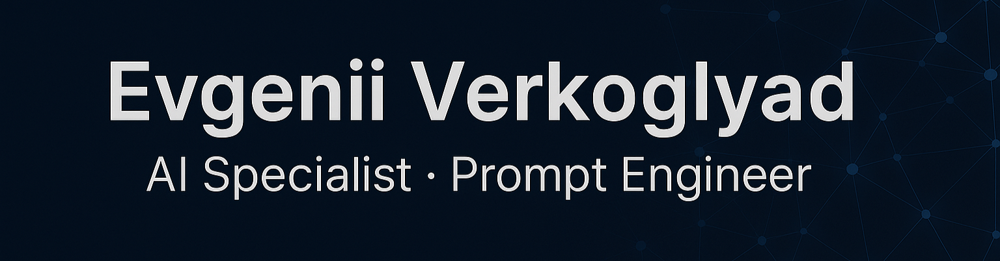

  

  <b>AI Engineer · Automation · Neural Networks · Creative Intelligence</b>

---

# 🇷🇺 Русская версия / 🇬🇧 English version

---

## 🇷🇺 Добро пожаловать!
Я — **Евгений Верхогляд**, специалист по искусственному интеллекту и промпт-инженер.  
Помогаю людям и бизнесу использовать возможности AI для создания креативных решений, автоматизации процессов и внедрения нейросетей в рабочие системы.

Создаю интеллектуальные решения с помощью нейросетей — от креативного контента до автоматизированных систем.  
Работаю с текстами, визуалами, видео, сценариями и ботами, внедряю AI в бизнес-процессы и помогаю выстраивать эффективные digital-стратегии.  
Главный принцип моей работы — использовать технологии не ради моды, а ради результата.

---

### 🧠 Чем я занимаюсь
- Разработка и оптимизация **prompt-запросов** для ChatGPT, DALL·E, Midjourney  
- Создание **визуального, текстового и видео-контента** с помощью нейросетей  
- Проектирование и **автоматизация рабочих процессов** через Python, n8n и AI API  
- Разработка **AI-ботов** и интеграция нейросетей в бизнес  
- Подготовка **контент-стратегий** и систем работы с нейросетями под задачи клиента  

---

### ⚙️ Технологии и инструменты

`ChatGPT` · `OpenAI API` · `YandexGPT` · `Midjourney` · `Runway ML` · `Leonardo AI` ·  
`Python` · `n8n` · `Cursor` · `GitHub` · `Notion` · `Canva` · `DaVinci Resolve`

---

### 💡 Миссия
Разрабатываю и внедряю AI-решения, объединяющие технологии, автоматизацию и креативный подход.  
Моя миссия — сделать искусственный интеллект рабочим инструментом, который приносит  
практическую пользу людям и бизнесу.

---

### 🚀 Проекты / Projects

#### 🇷🇺 Примеры реализованных решений
- **AI Content Automation** — автоматизация создания контента через ChatGPT и n8n  
- **Telegram AI Bot** — умный Telegram-бот с интеграцией OpenAI API  
- **Visual Generator Suite** — инструменты для генерации изображений через Midjourney и Leonardo AI  
- **AI Workflow Templates** — шаблоны рабочих процессов с интеграцией Python и YandexGPT  

#### 🇬🇧 Example Projects
- **AI Content Automation** — content generation automation using ChatGPT and n8n  
- **Telegram AI Bot** — smart Telegram bot integrated with OpenAI API  
- **Visual Generator Suite** — image generation tools via Midjourney and Leonardo AI  
- **AI Workflow Templates** — workflow templates integrating Python and YandexGPT  

---

### 🌐 Контакты

📧 **Email:** [paracriptus@gmail.com](mailto:paracriptus@gmail.com)  
💬 **Telegram:** [@VerhEvgeniiV](https://t.me/VerhEvgeniiV)  
🌍 **VK:** [vk.com/verh1770705](https://vk.com/verh1770705)

---

## 🇬🇧 Welcome!
I'm **Evgenii Verkhoglyad**, an Artificial Intelligence Specialist and Prompt Engineer.  
I help people and businesses unlock the power of AI — from creative solutions and automation  
to intelligent systems that improve efficiency and drive growth.

I develop applied AI solutions — combining neural networks, automation, and content generation.  
My approach bridges creativity and engineering to turn complex ideas into effective,  
practical tools powered by artificial intelligence.

---

### 🧠 What I Do
- **Prompt engineering and optimization** for ChatGPT, DALL·E, and Midjourney  
- Creating **visual, text, and video content** using AI tools  
- Designing and **automating workflows** via Python, n8n, and AI APIs  
- Developing **AI-powered bots** and integrating AI into business systems  
- Building **content strategies** and AI-driven frameworks tailored to client needs  

---

### ⚙️ Technologies & Tools

`ChatGPT` · `OpenAI API` · `YandexGPT` · `Midjourney` · `Runway ML` · `Leonardo AI` ·  
`Python` · `n8n` · `Cursor` · `GitHub` · `Notion` · `Canva` · `DaVinci Resolve`

---

### 💡 Mission
I design and implement AI solutions that unite technology, automation, and creativity.  
My mission is to make artificial intelligence a practical tool that delivers  
real value to people and businesses.

---

### 🌐 Contacts

📧 **Email:** [paracriptus@gmail.com](mailto:paracriptus@gmail.com)  
💬 **Telegram:** [@VerhEvgeniiV](https://t.me/VerhEvgeniiV)  
🌍 **VK:** [vk.com/verh1770705](https://vk.com/verh1770705)

---

  
    🇷🇺 Создано Евгением Верхоглядом · На основе AI и Креатива  
     
    🇬🇧 Created by <b>Evgenii Verkhoglyad</b> · Powered by <b>AI & Creativity</b>
  

